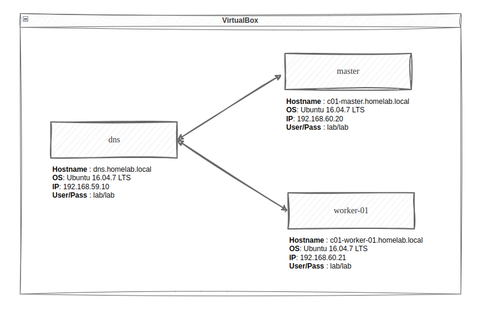

# Dns Local - Using k8s cluster for example
## Stack
- VirtualBox v7.0
- Ubuntu server v16.04.7 LTS

## Diagram


# Config Static IP Address
### Dns
sudo vim /etc/network/interfaces
```
# The second network interface
auto enp0s8
iface enp0s8 inet static
address 1192.168.59.10
netmask 255.255.255.0
gatway 192.168.59.2

# DNS server
dns-nameservers 192.168.59.10 8.8.8.8 8.8.4.4
```
### Master
sudo vim /etc/network/interfaces
```
# The second network interface
auto enp0s8
iface enp0s8 inet static
address 1192.168.60.20
netmask 255.255.255.0
gatway 192.168.59.2

# DNS server
dns-nameservers 192.168.59.10 8.8.8.8 8.8.4.4
```
### Worker-01
sudo vim /etc/network/interfaces
```
# The second network interface
auto enp0s8
iface enp0s8 inet static
address 192.168.60.21
netmask 255.255.255.0
gatway 192.168.59.2

# DNS server
dns-nameservers 192.168.59.10 8.8.8.8 8.8.4.4
```
# Config Domain Name
### Dns
Change hostname
```
sudo hostnamectl set-hostname dns
```
sudo nano /etc/hosts
```
192.168.59.10   dns.homelab.local
```
### Master
Change hostname
```
sudo hostnamectl set-hostname c01-master
```
sudo nano /etc/hosts
```
192.168.60.20   c01-master.homelab.local
```
### Worker-01
Change hostname
```
sudo hostnamectl set-hostname c01-worker-01
```
sudo nano /etc/hosts
```
192.168.60.21   c01-worker-01.homelab.local
```
# Install bind9 at Dns
bind9
```
sudo apt install -y bind9 bind9utils bind9-doc dnsutils
sudo systemctl start bind9
sudo systemctl status bind9
```
Allow firewal
```
sudo ufw status
sudo ufw allow bind9
```
Config bind9
- Move to bind dir
```
cd /etc/bind
```
- Config forward zone && reverse zone 
```
sudo nano named.conf.local

// Forward Zone
zone "homelab.local" IN { 							// Domain name : homelab.local
	type master; 								// Primary DNS : master
	file "/etc/bind/forward.homelab.local"; 				// Forward lookup file
	allow-update { none; }; 						// Primary DNS set : "none" ;
};

// Reverse Zone 
zone "59.168.192.in-addr.arpa" IN { 						// Reverse lookup name, should match your network in reverse order
	type master; 								// Primary DNS : master
	file "/etc/bind/reverse.homelab.local"; 				// Reverse lookup file
	allow-update { none; }; 						// Primary DNS set : "none;" ;
};
```
- Config Forwarders
```
sudo nano named.conf.options

forwarders {
	8.8.8.8;
	8.8.4.4;
};
```
- Config forward.homelab.local
```
sudo touch forward.homelab.local

$TTL                            604800
@                               IN      SOA             dns.homelab.local.      root.homelab.local. (
                                                        3                       ; Serial
                                                        604800                  ; Refresh
                                                        86400                   ; Retry
                                                        2419200                 ; Expire
                                                        604800 )                ; Negative Cache TTL

;--- DNS
@                               IN      NS              dns.homelab.local.

;--- K8S Cluster
homelab.local.                  IN      MX      10      c01-master.homelab.local.
homelab.local.                  IN      MX      10      c01-worker-01.homelab.local.


;--- DNS
dns                             IN      A               192.168.59.10

;--- K8S Cluster
c01-master                      IN      A               192.168.60.20
c01-worker-01                   IN      A               192.168.60.21

```

- Config reverse.homelab.local
```
$TTL            604800
@               IN      SOA             homelab.local.  root.homelab.local. (
                                        3               ; Serial
                                        604800          ; Refresh
                                        86400           ; Retry
                                        2419200         ; Expire
                                        604800 )        ; Negative Cache TTL

;--- DNS
@               IN      NS              dns.homelab.local.

;--- DNS
1               IN      PTR             dns.homelab.local.

;--- K8S Cluster
2               IN      PTR             c01-master.homelab.local.
3               IN      PTR             c01-worker-01.homelab.local.
```
Restart bind9
```
sudo named-checkconf
sudo named-checkzone homelab.local forward.homelab.local
sudo named-checkzone 59.168.192.in-addr.arpa reverse.homelab.local
sudo systemctl restart bind9
```
# Verify
## Dns 
```
lab@dns:~$ nslookup c01-master.homelab.local
Server:		127.0.0.1
Address:	127.0.0.1#53

Name:	c01-master.homelab.local
Address: 192.168.60.20
--

lab@dns:~$ nslookup  c01-worker-01.homelab.local
Server:		127.0.0.1
Address:	127.0.0.1#53

Name:	c01-worker-01.homelab.local
Address: 192.168.60.21
```
## Master 
```
lab@c01-master:~$ nslookup dns.homelab.local
Server:		192.168.59.10
Address:	192.168.59.10#53

Name:	dns.homelab.local
Address: 192.168.59.10
--


lab@c01-master:~$ nslookup c01-worker-01.homelab.local
Server:		192.168.59.10
Address:	192.168.59.10#53

Name:	c01-worker-01.homelab.local
Address: 192.168.60.21
```
## Worker-01 
```
lab@c01-worker-01:~$ nslookup dns.homelab.local
Server:		192.168.59.10
Address:	192.168.59.10#53

Name:	dns.homelab.local
Address: 192.168.59.10
--


lab@c01-worker-01:~$ nslookup c01-master.homelab.local
Server:		192.168.59.10
Address:	192.168.59.10#53

Name:	c01-master.homelab.local
Address: 192.168.60.20
```
